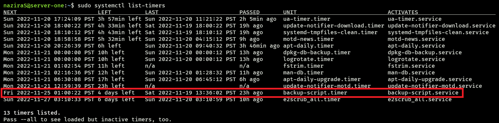

# <ins>**2420 Week 11 Lab**</ins>

This repo contains a script, a service file, and a timer file for each of  
1. **backing up directories from the current server to a backup server every Friday at 1am**
2. **displaying weather information of a specific city everyday at 5am**

In this README, we will be working with 1.

> **Note:** You can relatively follow along the README with setting up the `gtwtr` files.

---

## <ins>**1. Table of Contents**</ins>
- [**2420 Week 11 Lab**](#2420-week-11-lab)
  - [**1. Table of Contents**](#1-table-of-contents)
  - [**2. Set B Members**](#2-set-b-members)
  - [**3. Technologies Used**](#3-technologies-used)
  - [**4. Prerequisites and WSL Setup**](#4-prerequisites-and-wsl-setup)
  - [**5. Servers**](#5-servers)
    - [**5.1. Setting up server-one**](#51-setting-up-server-one)
    - [**5.2. Setting up backup-server**](#52-setting-up-backup-server)
  - [**6. Files**](#6-files)
    - [**6.1. Installation**](#61-installation)
    - [**6.2. Copy Files to server-one**](#62-copy-files-to-server-one)
    - [**6.3. Moving Script**](#63-moving-script)
    - [**6.4. Moving Unit Files**](#64-moving-unit-files)
    - [**6.5. Setting up Config File**](#65-setting-up-config-file)
    - [**6.6. Check Unit Files' Status**](#66-check-unit-files-status)
    - [**6.7. Usage**](#67-usage)
- [**Go to top**](#go-to-top)

---

## <ins>**2. Set B Members**</ins>

Nazira Fakhrurradi - A01279940  
(Doris) Yingyi He - A01230375  
(Kooby) Hai Run Yin - A01186094

---

## <ins>**3. Technologies Used**</ins>

- Bash
- Windows Subsystem for Linux (WSL) - Ubuntu
- DigitalOcean Droplets

---

## <ins>**4. Prerequisites and WSL Setup**</ins>

Watch the following video on setting up DigitalOcean (DO) server droplets.

[](https://vimeo.com/758870226/f75da348fc?embedded=true&source=vimeo_logo&owner=17609105 "DO Setup")

> **Note:** You will need to run Windows Terminal or Powershell as Administrator.  

1. Install `WSL Ubuntu` on your host machine.  

```
wsl --install -d Ubuntu
```

2. Connect to the root in `WSL` and create a regular user.
3. Exit out of the root user and reconnect to the newly-created regular user.

Good job, you have successfully completed the setup for `WSL`. 

> **Note:** Moving forward, we will be connecting to our own regular users throughout this README. Not to the root user.

---

## <ins>**5. Servers**</ins>

### <ins>**5.1. Setting up server-one**</ins>

This process is the same as what's shown in the video mentioned previously.  
It is **HIGHLY** recommended that you complete the process below while following along with the video.

1. First, connect to `WSL`. Then, generate a new SSH key of your choice using the `ssh-keygen` command.  
This SSH key will be used to create a `server-one` droplet in DO.  
So, go ahead and do that. If you get stuck, refer back to the video.
2. Upon successfully creating the droplet, go ahead and connect to the root in `server-one` via SSH.
3. Create a regular user. At this point onwards, the video will guide you through the rest of the process.

If you can connect from `WSL` to the regular user you created in `server-one`, good job.

> **Note:** We will only be connecting to `server-one` from `WSL`.

---

### <ins>**5.2. Setting up backup-server**</ins>

Same process as [**Setting up server-one**](#51-setting-up-server-one).

1. From `WSL`, connect to `server-one`. Then, generate a new SSH key of your choice using the `ssh-keygen` command.  
This SSH key will be used to create a `backup-server` droplet in DO.  
Again, follow the video.
2. Upon successfully creating the droplet, go ahead and connect to the root in `backup-server` via SSH.
3. Create a regular user.

If you can connect from `server-one` to the regular user you created in `backup-server`, good work.

To verify that everything works perfectly,  
1. from your Windows Terminal or Powershell, connect to `WSL`, then
2. from `WSL`, connect to `server-one`, then
3. from `server-one`, connect to `backup-server`.

If you are able to verify the above, good job! Server setup is completed.

---

## <ins>**6. Files**</ins>

### <ins>**6.1. Installation**</ins>

Clone the repo to your desired directory:  
`git clone https://github.com/Summry/2420_week11_Lab.git`

---

### <ins>**6.2. Copy Files to server-one**</ins>  

> **Note:** To make things easier for you, open a few terminals for different servers and connections.  

After cloning the repo, connect to `WSL` and move to the repo directory.

Then connect to `server-one` using `sftp`:  


Copy `backup-script`, `backup-script.service`, and `backup-script.timer` to `/home/username` that is in `server-one`:  


Output:  


For more help, visit [here](https://vimeo.com/770519622/1955abff3e?embedded=true&source=vimeo_logo&owner=17609105) to learn all that you need about `sftp`.

---

### <ins>**6.3. Moving Script**</ins>  

Copy `backup-script` into `/opt/backup`:  

```
username@server-one:~$ sudo cp backup-script /opt/backup
```

Output:  


---

### <ins>**6.4. Moving Unit Files**</ins>  

Copy `backup-script.service` and `backup-script.timer` into `/etc/systemd/system`:  

```
username@server-one:~$ sudo cp backup-script.service /etc/systemd/system
username@server-one:~$ sudo cp backup-script.timer /etc/systemd/system
```

Output:  


---

### <ins>**6.5. Setting up Config File**</ins>

In `server-one`, create a configuration file `server_one.conf` in `/etc`:  

```
username@server-one:~$ sudo vim /etc/server_one.conf
```

Inside the configuration file, append these two variables:

```
# Configuration file server_one.conf

DIRECTORIES=<directory/directories to backup>
IPADDR=<IP Address of your backup-server from DO>
```

> **Important:** This configuration file is where you manually reconfigure which directories you want to backup, and what IP Address to back it up to.

For example:  


--- 

### <ins>**6.6. Check Unit Files' Status**</ins>  

To confirm changes:  

```
username@server-one:/etc/systemd/system$ sudo systemctl daemon-reload
```

Start `backup-script.service` and check the status:  

```
username@server-one:/etc/systemd/system$ sudo systemctl start backup-script.service
username@server-one:/etc/systemd/system$ sudo systemctl status backup-script.service
```

Desired output:  


Enable both the service and timer:  

```
username@server-one:/etc/systemd/system$ sudo systemctl enable --now backup-script.service
username@server-one:/etc/systemd/system$ sudo systemctl enable --now backup-script.timer
```

Check the status of `backup-script.timer`:  

```
username@server-one:/etc/systemd/system$ sudo systemctl status backup-script.timer
```

Desired output:  


Check to see if both unit files are active, and the time when `backup-script.timer` will trigger `backup-script.service`:  


---

### <ins>**6.7. Usage**</ins>  

> **Note:** To change to your own usernames, the SSH key name, and the destination folder, simply edit `backup-script`.  
> For more information about `rsync`, click this [video](https://vimeo.com/770523139/c54cf132e7?embedded=true&source=vimeo_logo&owner=17609105).

Changing your timezone can be a pretty nice thing to do. That way the service will work with your current/local timezone instead of UTC.  
For example:  

```
username@server-one:~$ sudo timedatectl set-timezone America/Toronto
```

To test the script itself:  

```
username@server-one:~$ ./script
```

Example output:  


Checking the output in `backup-server`:  


# [<ins>**Go to top**</ins>](#2420-week-11-lab)
